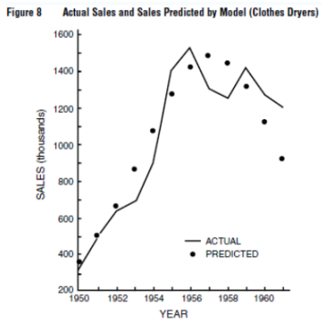
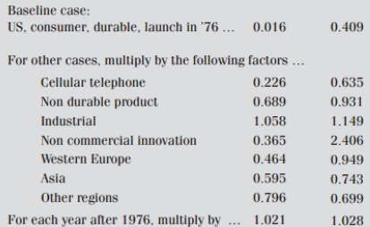
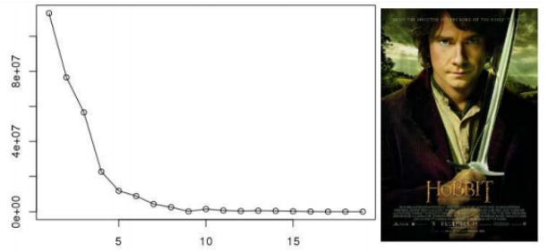
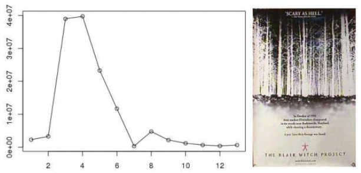
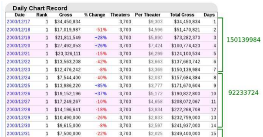

```{r setup, include=FALSE}
knitr::opts_chunk$set(echo = TRUE)
```

```{r include = FALSE}
library(ggplot2)
```

# Opakovanie prednášky

## Základné pojmy
* Čo je biely šum? (stredná hodnota, disperzia, autokovariancia)
* Čo je autokorelačná funkcia?
* Čo znamená ergodický proces?

## Generovanie dát
Vygenerujeme dáta - biely šum posunutý o konštantu, takže bude mať nulové autokorelácie.

```{r echo = TRUE}
N <- 150 # počet pozorovaní
set.seed(12345) # repredukovateľnosť výsledkov
x <- rnorm(N, mean = 5, sd = 1) # nezávislé z N(5,1)

```

Zobrazíme si priebeh vygenerovaných dát
```{r echo = FALSE, fig.align="center"}
data.x <- data.frame(index = 1:N,
                     x = x)
ggplot(data = data.x, aes(x = index, y = x)) +
  geom_line()

```

## Testovanie nulovosti autokorelácií - každá samostatne

Zobrazíme autokoreláčnú funkciu: (napr. príklaz acf)
```{r echo = FALSE, fig.align="center"}
acf.x <- as.vector(acf(x, plot = FALSE)$acf)
acf.x <- data.frame(Lag = as.factor(1:(length(acf.x)-1)),
                    ACF = acf.x[-1])
disp <- 2/sqrt(N)

# generate break positions
breaks = round(c(seq(-0.2, 0.2, by=0.05), disp,-disp), digits = 4)
# and labels
labels = as.character(breaks)

ggplot(data = acf.x, aes(x = Lag, ymax=ACF, ymin=0))+
  geom_linerange()+
  geom_hline(yintercept = disp,linetype='dashed', col = "#D55E00")+
  geom_hline(yintercept = -disp,linetype='dashed', col = "#D55E00")+
  geom_hline(yintercept = 0)+
  ggtitle(paste0("Series x"))+
  theme(plot.title = element_text(hjust = 0.5, size=14, face="bold"))+
  scale_y_continuous(limits = c(-0.2, 0.2), breaks = breaks, labels = labels,
                     name = "ACF")
  
```
**Otázky**:

* Akú hypotézu vieme takýmto prístupom testovať pre každú autokoreláciu?
* Aké vyzerá disperzia odhadu autokorelačnej funkcie, ak pracujeme s bielym šumom? Čo predpokladáme?
* Kedy hypotézu $H_{0}$ zamietame? Ako vyzerá interval spoľahlivosti?
* Čo dostaváme v našom prípade?

## Testovanie nulovostí autokorelácií - Ljung-Boxov test

Otestujte Ljung-Boxovým testom, že autokorelácie rádu 1,2,3,4 sú súčasne nulové ($\rho_1=\rho_2=\rho_3=\rho_4=0$)
```{r echo = FALSE}
Box.test(x, lag = 4, type = "Ljung-Box")
```

**Otázky**:

* Ako sa vypočíta testovacia štatistika?
* Aké je pravdepodobnostné rozdelenie štatistiky za platnosti nulovej hypotézy $H_{0}$?
* Pre aké hodnoty testovej štatistiky zamietame hypotézu $H_{0}$?
* Ako sa určí p-hodnota?
* Čo dostávame v našom prípade?

V cykle vypočítajte p-hodnoty zodpovedajúce testovaniu hypotézy, že prvých **k** autokorelácií je súcasne nulových. Výsledok znázornite graficky, zobrazte získané p hodnoty a hranicu 0.05.

Oplatí sa nastaviť y-ovú os na interval (0, 1), aby bol skript univerzálny pre všetky dáta, aby sa vždy (aj pri vysokých p hodnotách) dala vidieť vyznačená hodnota 0.05, s ktorou p hodnoty porovnávame.

```{r, echo = FALSE, fig.align="center"}
k <- 10
p.values <- c()
for(i in 1:k)
{
  p.values <- c(p.values,
                Box.test(x, lag = i, type ="Ljung-Box")$p.value)
}

p.values <- data.frame(p.values = p.values,
                       Lags = as.factor(1:k))

ggplot(data = p.values, aes(x = Lags, y= p.values))+
  geom_point(size=2, shape=23)+
  geom_hline(yintercept = 0.05,linetype='dashed', col = '#D55E00')+
  geom_hline(yintercept = 0)+
  ggtitle(paste0("Ljung-Boxov test - p-values"))+
  theme(plot.title = element_text(hjust = 0.5, size=14, face="bold"))+
  scale_y_continuous(limits = c(0, 1))
```

# Analýza výnosov akcií
Pomocou knižnice `quantmod` načítame priamo do R-ka ceny akcií a zistíme, či sú korelované alebo nie.

## Načítanie dát o cenách akcií pomocou knižnice quantmod
Načítajte (ak treba, tak nainštalujte) knižnicu `quantmod`
```{r message=FALSE, warning= FALSE}
library(quantmod)
```

Na získanie cien akcií sa použije funkcia `getSymbols`, napríklad:
```{r message = FALSE}
getSymbols("NFLX", from = "2019-01-01", to = "2020-01-01", auto.assign = TRUE)
```
Pozrime sa, ako vyzerajú naše dáta, ktoré sú uložené v premennej `NFLX`, zobrazíme ich začiatok:

```{r}
head(NFLX)
```

## Grafy pomocou quantmod
Napr.:
```{r, fig.align="center"}
chartSeries(NFLX, up.col = "#009E73", dn.col = "#D55E00")
```

Skúste aj:
```{r, fig.align="center"}
chartSeries(NFLX, subset="2019-06::2019-12", up.col = "#009E73", dn.col = "#D55E00") # od juna do septembra
```

```{r, fig.align="center"}
NFLX.mesacne <- to.monthly(NFLX)  # mesacne data
NFLX.mesacne                      # vypiseme
chartSeries(NFLX.mesacne, up.col = "#009E73", dn.col = "#D55E00")         # graf
```

## Výnosy akcií
Z týchto dát `NFLX` budeme potrebovať posledný stĺpec (`NFLX.Adjusted`), z ktorého vypočítame výnosy. Budeme pracovať zo spojitými výnosmi, teda denné výnosy sa budú počítať ako logaritmus podielu cien v dvoch po sebe idúcich dňoch. Ekvivalentne:

```{r}
ceny <- NFLX$NFLX.Adjusted
vynosy <- diff(log(ceny))
vynosy <- vynosy[-1]
```

Priebeh výnosov:
```{r, fig.align="center"}
chartSeries(vynosy, theme=chartTheme('white',up.col="#009E73"))
```

Autokorelačná funkcia:
```{r echo = FALSE, fig.align="center"}
acf.vynosy <- as.vector(acf(vynosy, plot = FALSE)$acf)
acf.vynosy <- data.frame(Lag = as.factor(1:(length(acf.vynosy)-1)),
                    ACF = acf.vynosy[-1])
disp <- 2/sqrt(length(vynosy))

# generate break positions
breaks = round(c(seq(-0.25, 0.25, by=0.05), disp,-disp), digits = 4)
# and labels
labels = as.character(breaks)

ggplot(data = acf.vynosy, aes(x = Lag, ymax=ACF, ymin=0))+
  geom_linerange()+
  geom_hline(yintercept = disp,linetype='dashed', col = '#D55E00')+
  geom_hline(yintercept = -disp,linetype='dashed', col = '#D55E00')+
  geom_hline(yintercept = 0)+
  ggtitle(paste0("Series x"))+
  theme(plot.title = element_text(hjust = 0.5, size=14, face="bold"))+
  scale_y_continuous(limits = c(-0.25, 0.25), breaks = breaks, labels = labels,
                     name = "ACF")
  
```

## Testovanie autokorelácií
Zistite, či výnosy firmy Netflix sú nekorelované. Použite výberovú autokorelačnú funkciu a Ljung-Boxov test.

(Výsledok)
```{r echo = FALSE, fig.align="center"}
k <- 10
p.values <- c()
for(i in 1:k)
{
  p.values <- c(p.values,
                Box.test(vynosy, lag = i, type ="Ljung-Box")$p.value)
}

p.values <- data.frame(p.values = p.values,
                       Lags = as.factor(1:k))

ggplot(data = p.values, aes(x = Lags, y= p.values))+
  geom_point(size=2, shape=23)+
  geom_hline(yintercept = 0.05,linetype='dashed', col = '#D55E00')+
  geom_hline(yintercept = 0)+
  ggtitle(paste0("Ljung-Boxov test - p-values"))+
  theme(plot.title = element_text(hjust = 0.5, size=14, face="bold"))+
  scale_y_continuous(limits = c(0, 1))
```


# Bassov model

**Frank Bass (1926-2006)** - priekopník matematických modelov v marketingu

```{r  echo=FALSE, fig.align="center",  out.width = '30%'}
knitr::include_graphics("images/Bass.png")
```

**F. Bass, A New Product Growth for Model Consumer Durables, Management Science, Vol. 15 (January 1969)**

* Jeden z desiatich článkov vo výbere Top 10 Most Influential Papers published in the 50-year history of Management Science (2004)

* Perhaps the first thing to notice. . . is the title. It contains a typo. The correct title should be A New Product Growth Model for Consumer Durables. I suppose that I was so excited about having the paper accepted for publication that I failed to carefully proofread the galley proofs. (Frank Bass, 2004)

* Matematický model pre zavedenie nového produktu na trh

Príklad z pôvodného Bassovho článku:

```{r  echo=FALSE, fig.align="center", out.width = '50%'}

```

## Inovátori a imitátori
Základná myšlienka Basovho modelu - na trhú existujú 2 druhy zákazníkov

* **Inovátori** - tovar si zakúpia na základe informácií o novom produkte, reklamy, atď
* **Imitátori** - rozhodujú sa podľa skúsenosti iným používateľov a ich hodnotenia

```{r include = FALSE}
library(gridExtra)
```

Inovátori a imitátori - počet nových zákazníkov:
```{r echo = FALSE, fig.align="center"}
x <- seq(0, 10, length=10000)
inov <- dexp(x,  rate = 0.3)
imit <- #dgamma(x, shape = 2, rate = 0.5)
  dchisq(x, df = 4, ncp =0, log = FALSE)

customers <- data.frame(New_customers = c(inov*35000,imit*85000,
                                          inov*35000+imit*85000),
                    type = c(rep("Inov",10000),
                             rep("Imit",10000),
                             rep("New_cust",10000)),
                    Mesiac = rep(x*10,3))

ggp1 <-ggplot(data = NULL)+
  geom_line( aes(x = x*10, y = inov*35000), color = "#009E73")+
  ylab("New customers")+
  xlab("Month")+
  ggtitle("Innovators")+
  theme(plot.title = element_text(hjust = 0.5, size=14, face="bold"))+
  scale_y_continuous(limits = c(0, 20000))

ggp2 <-ggplot(data = NULL)+
  geom_line( aes(x = x*10, y = imit*85000), color = "#D55E00")+
  ylab("New customers")+
  xlab("Month")+
  ggtitle("Imitators")+
  theme(plot.title = element_text(hjust = 0.5, size=14, face="bold"))+
  scale_y_continuous(limits = c(0, 20000))

grid.arrange(ggp1, ggp2, ncol = 2)      
```

Počet nových zákazníkov spolu:

```{r echo = FALSE, fig.align="center"}
ggplot(data = customers, aes(x = Mesiac, y = New_customers, group = type))+
  geom_line(aes( color = type))+
  ylab("New customers")+
  xlab("Month")+
  ggtitle("Customers")+
  theme(plot.title = element_text(hjust = 0.5, size=14, face="bold"))+
  scale_y_continuous(limits = c(0, 23000))+
  scale_color_manual(values=c("#D55E00", "#009E73", "black"))
  
```

Počet nových zákazníkov a kumulatívny počet zákazníkov:
```{r echo = FALSE, fig.align="center"}
ggp1 <-ggplot(data = NULL)+
  geom_line( aes(x = x*10, y = inov*35000+imit*85000), color = "black")+
  ylab("New customers")+
  xlab("Month")+
  ggtitle("Customers")+
  theme(plot.title = element_text(hjust = 0.5, size=14, face="bold"))

ggp2 <-ggplot(data = NULL)+
  geom_line( aes(x = x*10, y = cumsum(inov*35000+imit*85000)), color = "black")+
  ylab("Cumulative number of customers")+
  xlab("Month")+
  ggtitle("Customers")+
  theme(plot.title = element_text(hjust = 0.5, size=14, face="bold"))

grid.arrange(ggp1, ggp2, ncol = 2) 
```

## Odvodenie matimatického modelu

* Odvodenie sa dá spraviť v diskrétnom alebo spojitom čase, v spojitom je to ľahšie
* Matematická formulácia:
    + Máme spojitý čas $t$
    + $F(t)$ = podiel ľudí z celkového trhu, ktorí si zakúpili produkt do času $t$
    + $f(t)$ = podiel ľudí z celkového trhu, ktorí si zakúpili produkt v čase $t$, platí teda $f(t)=F'(t)$
    + Základný predpoklad modelelu je: **Pravdepodobnosť toho, že si človek kúpi produkt v čase $t$, ak si ho doteraz nekúpil, sa dá vyjadriť ako $p+qF(t)$**
    + Parameter $p$ vyjadruje vplyv inovátorov, parameter $q$ vplyv imitátorov
    + Dostávame teda diferenciálnu rovnicu:\
$$
\begin{aligned}
 \frac{f(t)}{1-F(t)}=p+qF(t)
\end{aligned}
$$
 s podmienkou $F(0)=0$
 
## Riešenie 
Majme obyčajnú diferenciálnu rovnicu pre funkciu $F(t)$:
$$
\begin{aligned}
 \frac{F'(t)}{1-F(t)}=p+qF(t),F(0)=0
\end{aligned}
$$
Takúto rovnicu vieme riešiť metódou separácie premenných:
$$
\begin{aligned}
 \frac{dF(t)}{(1-F(t)(p+qF(t))}=dt,F(0)=0
\end{aligned}
$$

Vyriešením dostávame:
$$
\begin{aligned}
 F(t)=\frac{1-e^{-(p+q)t}}{1+\frac{q}{p}e^{-(p+q)t}}
\end{aligned}
$$
Príslušná funkcia $f(t)=F'(t)$:(Ľahko sa dá overiť derivovaním)
$$
\begin{aligned}
 f(t)=\frac{(p+q)^{2}e^{-(p+q)t}}{p[1+\frac{q}{p}e^{-(p+q)t}]^{2}}
\end{aligned}
$$

## Teoretická časť
* Odvodte vzťahy pre funkcie $f(t)$ a $F(t)$
    + (Návod: rozklad na parciálne zlomky)
$$
\begin{aligned}
 \frac{1}{(1-F(t))(p+qF(t))} = \frac{A}{(1-F(t))}+\frac{B}{p+qF(t)}
\end{aligned}
$$
* Dokážte, že ak $q>p>0$, tak funkcia $f(t)$ nadobúda maximum v čase
$$
\begin{aligned}
 t^{*}=\frac{ln(\frac{q}{p})}{p+q}
\end{aligned}
$$
    Voľne povedané, je to čas, v ktorom sa predá najviac výrobkov
* Odvodte vzťah pre maximum funkcie $f(t)$ v prípade, že $p>q>0$. Čo od tohto prípade - keď prevláda vplyv inovátorov - očakávame?
    
## Odhadovanie parametrov Bassovho modelu v R

Z článku Christophe Van den Bulte: Want to know how diffusion speed varies across countries and products? Try using a Bass model. PDMA Visions 26(4) 2002, pp. 12-15

```{r  echo=FALSE, fig.align="center",  out.width = '50%'}

```

**Grafické znázornenie:**

Definujeme si funkciu 
```{r}
grafy <- function(p,q,t.max) {
  t <- seq(from=0,to=t.max,by=0.01)
  Bass.f <- ((p+q)^2/p)*exp(-(p+q)*t)/(1+(q/p)*exp(-(p+q)*t))^2
  Bass.F <- (1-exp(-(p+q)*t))/(1+(q/p)*exp(-(p+q)*t))
  
  ggp1 <-ggplot(data = NULL)+
  geom_line( aes(x = t, y = Bass.f), color = "black")+
  ylab("Bass.f")+
  xlab("t")

  ggp2 <-ggplot(data = NULL)+
  geom_line( aes(x = t, y = Bass.F), color = "black")+
  ylab("Bass.F")+
  xlab("t")

grid.arrange(ggp1, ggp2, ncol = 2) 
}
```

Teraz vieme kresliť grafy, napríklad:
```{r, fig.align="center"}
grafy(0.016, 0.409, 20) # baseline z tabulky
```

## Interaktívne grafy

Ukážeme si, ak robit takéto interaktívne grafy:

Načítajte (ak treba, aj nainštalujte) knižnicu `manipulate`:
```{r echo= FALSE,warning=FALSE}
library(manipulate)
```

Použitie funkcie `manipulate` najlepšie vidieť na príklade (dostaneme graf z predchádzajúceho obrázku):

```{r}
#manipulate(grafy(p,q,t.max),
#  p=slider(min=0.001, max=0.1, step=0.001),
#  q=slider(min=0.1, max=1, step=0.01),
#  t.max=slider(min=5, max=30, step=5))
```

V parametroch pre `slider` sa dá zadať aj začiatocná hodnota - pomocou `initial=...` - vyskúšajte.

Podrobnejšie: `?slider`

## Aplikácia nelineárnej metódy najmenších štvorcov

Ak máme historické dáta, môžeme fitovať funkciu $f(t)$ metódou najmenších štvorcov.

Parametre modelu určíme tak, aby sa minimalizovala suma štvorcov odchýlok skutočných a namodelovaných dát - závislosť $f(t)$ od parametrov je nelineárna, preto ide o **nelineárnu metódu nejmenších štvorcov**

## Príklad: odhadovanie parametrov Bassovho modelu z dát

Zdroj dát: *P. S. P. Cowpertwait, A. V. Metcalfe, Introductory Time Series with R. Springer 2009. Kapitola 3.3.4, str. 52-54*

Budeme modelovať predaj VCR v USA v rokoch 1980-1989:
```{r}
T <- 1:10 # casova premenna, rok = 1979 + T
Sales <- c(840,1470,2110,4000,7590,10950,10530,9470,7790,5890) # trzby
```

Model: `Sales(t) = M * f(t)`, kde `M` zodpovedá nasýteniu trhu

**Úloha 1:** Vykreslite priebeh tržieb.

**Nelineárna MNŠ v R-ku:** funkcia `nls`

Potrebuje štartovacie hodnoty pre odhadované parametre:

* pre `p` a `q` ich zoberieme z horeuvedenej tabuľky z článku

* pre `M` zoberieme doterajšie tržby (už klesajú a oveľa viac ich už nebude)

* alebo pomocou interaktívnych grafov nájdeme parametre, ktoré naše dáta “nefitujú zle”.

**Použitie funkcie:**
```{r}
Bass.nls<-nls(Sales ~ M*(((P+Q)^2/P)*exp(-(P+Q)*T))/(1+(Q/P)*exp(-(P+Q)*T))^2,
  start=c(list(M=sum(Sales),P=0.008,Q=0.6)))
summary(Bass.nls)
```

Vidíme, že algoritmus skonvergoval a dostali sme odhady parametrov `M, P, Q`.

**Úloha 2:** Porovnajte skutočné tržby s fitovanými a spravte predikciu na nasledujúce roky.

**Poznámka:** Užitočný môže byt **prístup k odhadnutým parametrom:**
```{r}
coef(Bass.nls)
```

```{r}
coef(Bass.nls)["P"]
```

Použite Bassov model na modelovanie nasledovných dát: [Sales volume of smartphones to private consumers in Germany from 2005 to 2019](https://www.statista.com/statistics/460113/smartphones-sales-revenue-germany/).  Zobrazte do jedného obrázku priebeh dáta a hladkú krivku fitovaných hodnôt (aj pre nasledujúce časy - t. j. predikcie do budúcnosti).
```{r}
Mobile <- c(268,297,291,540,1117,2710,5144,6806,8086,8830,9832,9566,10004,11252,10860,11223)
```

## Modelovanie návštevnosti filmov v kinách Bassovým modelom

### Návštevnosť filmov - inovátori a imitátori

Aj tu má zmysel rozlišovať:

* niektorí ľudia idú do kina, lebo o filme vedeli a chceli ho vidiet (inovátori v Bassovom modeli)

* iní sa rozhodli na základe odporúčania tých, ktorí ho už videli (imitátori v Bassovom modeli)

### Dva typy filmov

1. Reklama, očakávaný film - veľká časť ľudí si film pozrie v prvých dňoch, napr. The Hobbit: An Unexpected Journey (2012)

Priebeh tržieb po týždňoch:

```{r  echo=FALSE, fig.align="center",  out.width = '70%'}

```

2. Film, ktorý sa populárnym stane až neskôr, napr. The Blair Witch Project (1999)

Priebeh tržieb po týždňoch:

```{r echo=FALSE, fig.align="center", out.width = '70%'}

```

### Príklad

Dáta sa dajú nájsť napríklad na stránke http://www.the-numbers.com

Budeme používať týždenné dáta (1.-7. deň, 8.-14. deň, atď.)

```{r  echo=FALSE, fig.align="center",  out.width = '50%'}

```

```{r}
# The LOTR: Return of the King
Sales <- c(150139984,92233724,52192378,20100138,15302761,9109110,7300394,5612861,5995863,3809753,3140000,4062251,2923806,2055943)
```

**Úloha:** Odhadnite parametre Bassovho modelu a zobrazte priebeh skutočných a fitovaných tržieb.

## Interaktívne grafy pri určovaní štartovacích hodnôt parametrov

Pomocou knižnice `manipulate` napíšte skript, ktorý nakreslí reálne dáta ako body a hodnoty z modelu ako hladkú krivku. Zmenou hodnôt parametrov takto potom môžeme nájsť vhodné štartovacie hodnoty pre nelineárnu metódu najmenších štvorcov.


# Rmarkdown

Užitočné odkazy na tvorbu Rmarkdownu/syntax:

* R markdown: http://rmarkdown.rstudio.com/

* Konkrétne HTML dokumenty: https://bookdown.org/yihui/rmarkdown/html-document.html

* Užitočný môže byť aj interaktívny notebook: https://bookdown.org/yihui/rmarkdown/notebook.html